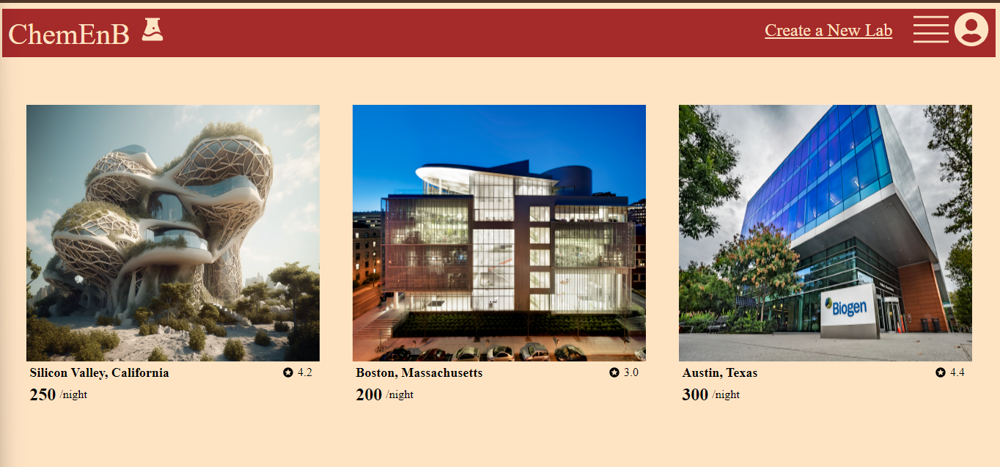

# ChemEnB

## Introduction

Welcome to **ChemEnB**! This project aims to provide a user-friendly platform for discovering and booking labs. 
Whether you're a scientist looking for a lab space or a host wanting to bring intelectuals into your high end spaces, ChemEnB offers an intuitive interface for exploring labs, 
viewing detailed information, and managing listings.

### Key Features

1. **Landing Page - List of All Spots**: View a tile list of all rental spots, including thumbnails, location, price, and ratings.
2. **Spot Details**: Explore detailed information about each spot, including images, location, host details, and price.
3. **Ratings and Reviews**: See ratings and reviews for each spot and post your own reviews.
4. **Create, Update, and Delete Spots**: Manage your own listings by creating, updating, or deleting spots.
5. **Post and Manage Reviews**: Leave reviews for spots and manage your own reviews.



## Technologies Used

ChemEnB is built using a combination of modern technologies:

- **Frontend**: React, Redux, CSS
- **Backend**: Node.js, Express
- **Database**: PostgreSQL
- **Authentication**: JWT
- **Deployment**: Render

## Running the Application Locally

To get started with SpotFinder locally, follow these steps:

1. **Clone the Repository**

   ```bash
   git clone https://github.com/James-Jon27/ChemEnB
   cd AirBnB_project
   cd frontend
   npm install
   cd ../backend
   npm install
   ```
   Set up a `.env` file in `backend` directory and add the following environment variables.
   ```.env
    PORT=<<port number>>
    DB_FILE=<<Database>>
    JWT_SECRET=<<JWT>>
    JWT_EXPIRES_IN=<<JWT>>
    SCHEMA=J<<Shcema Name>>
   ```

   Run the app
   ```bash
   cd backend
   npm start
   cd ../frontend
   npm run dev
   ```

   Open your web browser and navigate to `http:localhost:<<port number>>` to view the backend. Use `http:localhost:5173` to view the backend.
   
